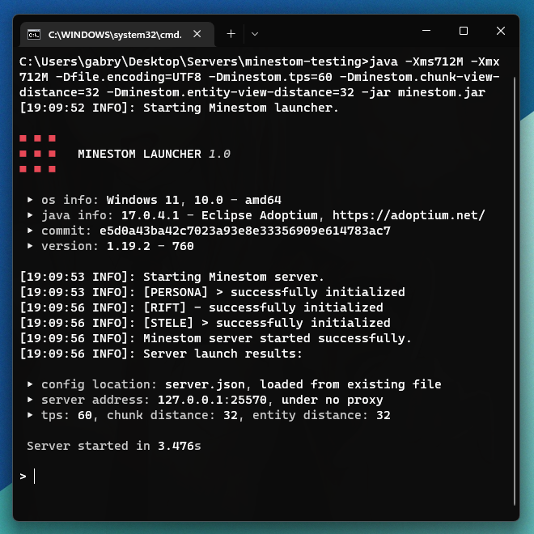

# Minestom Launcher

[](https://github.com/The-Crown-Studios/MinestomLauncher/blob/main/LICENSE)

Minestom Launcher is a Java software that runs a [Minestom](https://minestom.net/) server like you would do with Bukkit/Sponge/Quilt.



# Download & Installation
It's simple as installing a Bukkit server: you must download the jar from the tags section on this GitHub page and then
run the jar like you would do with the bukkit one. Remember you can always clone the project and build it yourself.

# Minestom Configuration
After the first start you will notice that a file named `server.json` will be created, this file
is the equivalent of the `server.properties` for the Bukkit servers. You can change anything you need for your server,
even the `tps` (`ticks per second`), but the value must be between 1 and 128.

```json
{
  "network" : {
    "ip" : "127.0.0.1",
    "port" : 25565,
    "open_to_lan" : false
  },
  "proxy" : {
    "enabled" : false,
    "type" : "",
    "secret" : ""
  },
  "server" : {
    "ticks_per_second" : 20,
    "chunk_view_distance" : 8,
    "entity_view_distance" : 6,
    "online_mode" : false,
    "optifine_support" : true,
    "terminal" : false,
    "benchmark" : false
  }, 
  "instance": {
    "enabled": false, 
    "type": "flat"
  }
}
```
**NOTE: The `server.json` on the repository only exists for testing purpose, the build script will ignore it!**

# Logger Configuration
The launcher use a custom TinyLog configuration with many changes and different formatting, if you want to change the config go inside the jar and modify the file named `tinylog.properties`**.**

```properties
# this is the tinylog.properties inside the jar

# tinylog config
autoshutdown          = true
writingthread         = true

# logs to a console
writerConsole         = minestom console
writerConsole.level   = info
writerConsole.format  = [{date: HH:mm:ss} {level}] [{thread}] [{class-name}.{method}]: {message}
writerConsole.charset = UTF-8

# logs to a file
writerFile            = rolling file
writerFile.level      = info
writerFile.format     = [{date: HH:mm:ss} {level}] [{thread}] [{class-name}.{method}]: {message}
writerFile.file       = logs/{date:dd-MM-yyyy} - {count}.log
writerFile.latest     = logs/latest.log
writerFile.charset    = UTF-8
writerFile.buffered   = true
writer.policies       = startup, daily: 00:00, size: 1mb
writerFile.backups    = 100
writerFile.convert    = gzip
```

# Roadmap
- [x] GitHub actions
- [ ] Commands
- [ ] Packs (add custom biomes, dimensions, modify blocks behavior)

# License
This project is licensed under the [General Public License 3.0](LICENSE).